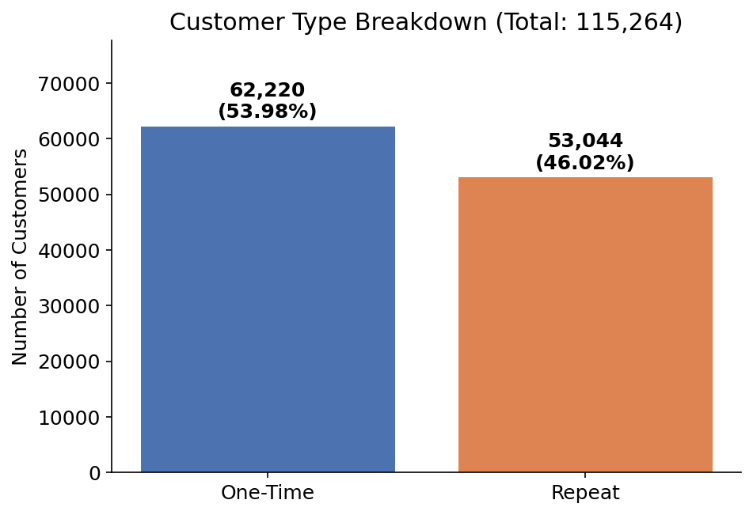
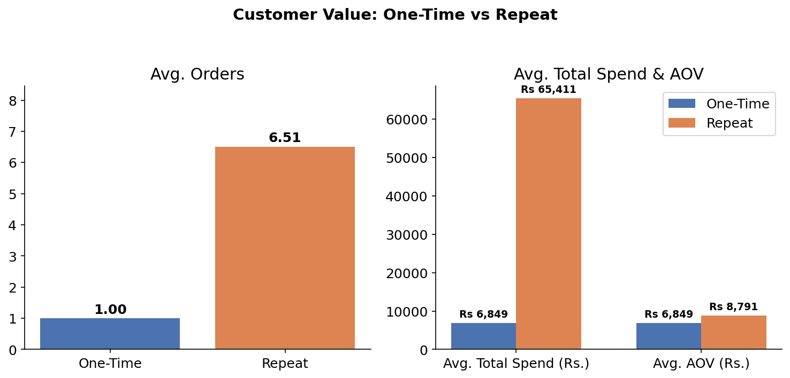
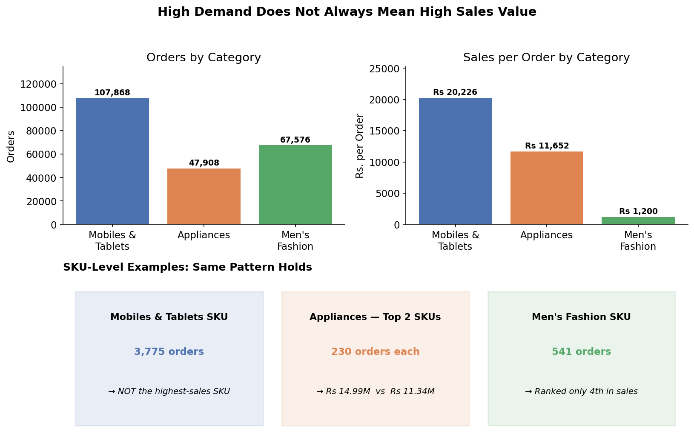
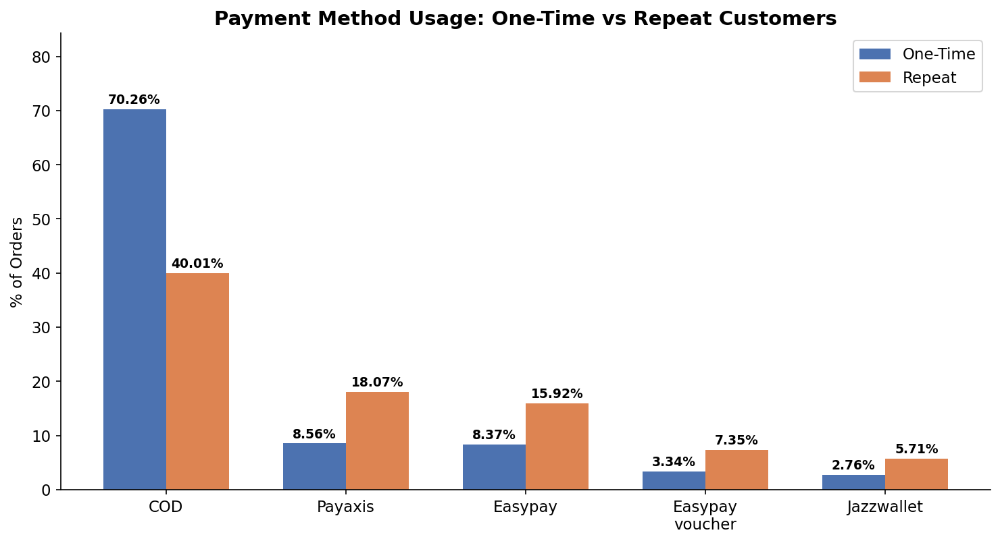
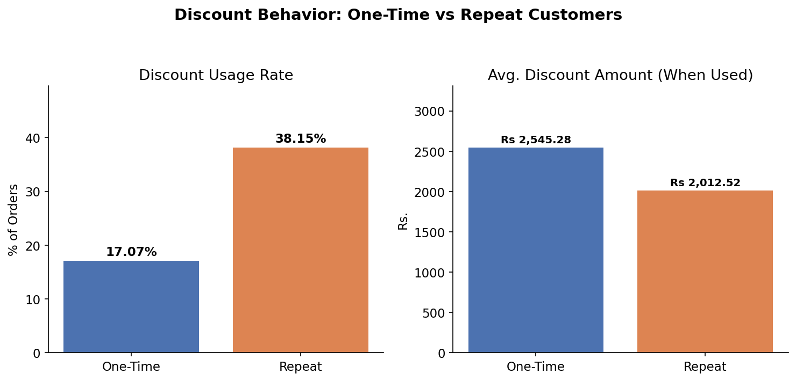
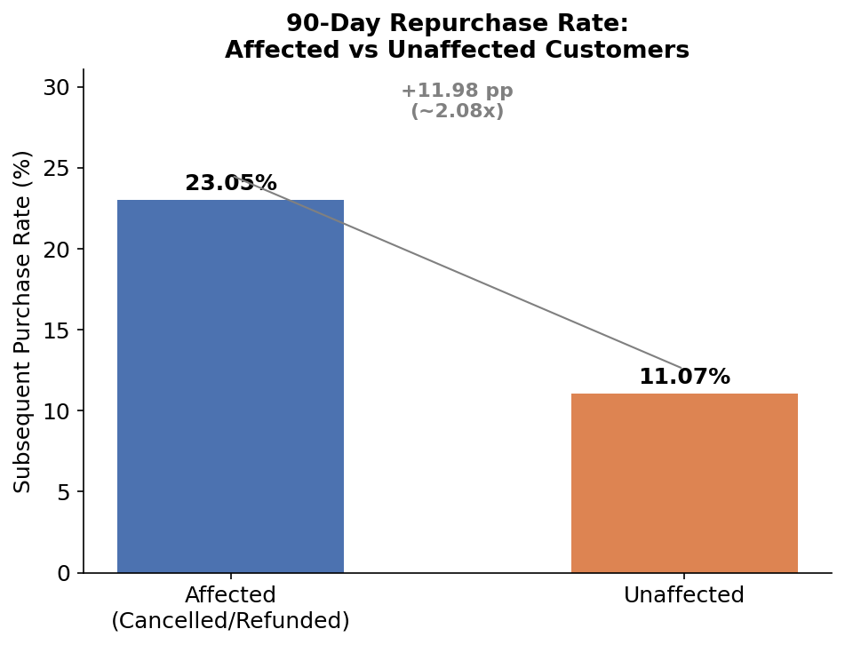
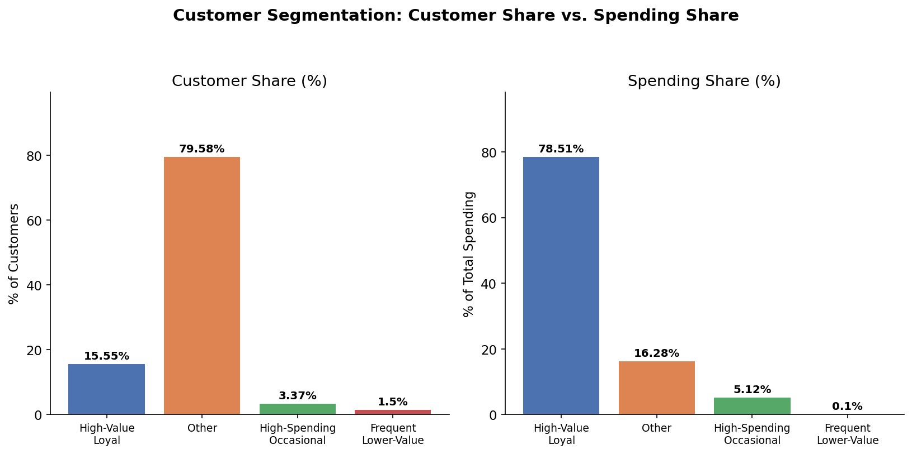

Project Overview

The e-commerce business wants to better understand repeat-purchase behavior and identify the customer segments that contribute to stronger sales performance. This project uses SQL to explore the Pakistan Largest E-Commerce Dataset — analyzing purchasing frequency, spending, product categories, payment methods, discounts, and order outcomes — to compare one-time and repeat customers and identify patterns associated with higher customer value and repeat purchasing.

Business Problem

Retention effort and discount spend are limited resources. The business needs to know which customers are actually worth prioritizing, which products drive real revenue versus just order volume, and whether a cancelled or refunded order really means a customer is gone for good. Without this, support and marketing spend risks being spread evenly instead of aimed at the customers and moments where it has the most impact.

Data Overview

| Attribute | Detail |
|---|---|
| Dataset | Pakistan Largest E-Commerce Dataset |
| Database | PostgreSQL 18, database `capstoneproject_sql`, working table `pakistan_ecommerce_data` (source: `raw_data`) |
| Raw records | 584,524 order line items |
| Date range | July 1, 2016 – August 28, 2018 |
| Grain | Line-item level, not order level — `item_id` = one product line, `increment_id` = the actual order (an order can span multiple rows) |
| Core fields | Customer ID, order ID (`increment_id`), item ID, order date (`created_at`), product category, SKU, price, quantity, discount amount, `grand_total`, payment method, order status |
| Key quirk | `grand_total` is an order-level value repeated on every line item in that order, not a per-item amount |
| Post-cleaning size | 582,878 line items across 407,285 unique orders (see Data Profiling below) |

Key Questions Answered

* What proportion of customers are one-time vs. repeat buyers, and how much more valuable are repeat customers?
* Which product categories generate the strongest sales and order demand?
* How do payment method and discount usage differ between one-time and repeat customers?
* Are customers with a cancelled or refunded order less likely to buy again?
* Which customers qualify as "high-value" based on purchase frequency and total spend?

Data Profiling

Starting point: 584,524 raw records, imported via PostgreSQL's `\copy` (client-side import, run from pgAdmin's PSQL Workspace, after the server-side `COPY` was blocked by Windows folder permissions). The original `raw_data` table was kept untouched; all cleaning happened on a separate working table, `pakistan_ecommerce_data`.

| Step | Issue found | Decision |
|---|---|---|
| Test records | 1,646 records with SKU starting `test-product` | Removed — not genuine transactions |
| Duplicates | 0 duplicate `item_id` values across 582,878 records | `item_id` confirmed safe as a unique line-item key |
| Order structure | 582,878 line items → 407,285 unique orders (via `increment_id`) | Confirmed line-item-level grain |
| Missing `customer_id` | 11 records across 9 orders | Retained for order-level analysis; excluded from customer-level analysis (never inferred) |
| Missing SKU | 20 records with NULL SKU | Kept as NULL; excluded from SKU-specific analysis |
| Category placeholders | NULL / `\N` values | Standardized to `"Unknown"` (6,407 records) |
| Status placeholders | 15 NULL statuses (plus 4 `\N` on already-removed test records) | Standardized to `"Unknown"` |
| Price | 0 negative, 2,224 zero-price records | Retained — plausible free/promotional items, no evidence of invalidity |
| Quantity | 0 NULL / negative / zero | Fully clean, no action needed |
| Negative `grand_total` | 76 records, totaling -22,512.33 | Retained — consistent with refund/cancellation adjustments |
| Negative discounts | 2 records | Retained — arithmetic (`price × qty − discount = grand_total`) reconciled correctly |
| Reconciliation (order level) | Of 407,285 orders: 330,164 reconciled (81.1%), 77,121 differed (18.9%) | Data not modified; `grand_total` used as recorded rather than reconstructed |
| Dates | 0 missing `created_at`; matches `working_date` 100% of the time | `created_at` used as the primary order date |
| `bi_status` | 1 `#REF!` Excel error | Converted to `"Unknown"`; record retained |
| `sales_commission_code` | Largely messy/free-text field, not central to the research question | `\N` → NULL (474,572 records); populated values left unchanged |

**Guiding principle:** clean according to analytical purpose, not simply because a column looks messy. Missing data was never fabricated or guessed — it was either retained with a clear "Unknown"/NULL label, or excluded from the specific analysis it would distort, with the exclusion documented.

**Critical structural note:** the dataset is recorded at the item (line-item) level, not the order level — `item_id` is a single product line, `increment_id` is the true order identifier, and `grand_total` is an order-level value repeated on every line item within that order. Order counts and totals must therefore be built from `COUNT(DISTINCT increment_id)` and `MAX(grand_total)` per order, never `COUNT(*)` or a raw `SUM(grand_total)` on line-item rows — this rule underlies every query in this report.

Calculated Columns

Beyond the raw fields, the following derived columns were built during analysis and reused across multiple questions:

*Order-level*

| Column | Derivation |
|---|---|
| `order_total` | `MAX(grand_total)` per `increment_id` — collapses the repeated line-item value to one true order total |
| `order_demand` | `COUNT(DISTINCT increment_id)` — number of unique orders |
| `sales_per_order` | Total sales ÷ order demand |

*Customer-level*

| Column | Derivation |
|---|---|
| `total_orders` | `COUNT(DISTINCT increment_id)` per customer |
| `total_spend` / `total_spending` | `SUM(order_total)` per customer |
| `average_order_value` (AOV) | `AVG(order_total)` or `total_spend ÷ total_orders` per customer |
| `customer_type` | `CASE WHEN total_orders = 1 THEN 'One-Time' ELSE 'Repeat' END` |
| `frequency_quartile` / `spending_quartile` | `NTILE(4)` over `total_orders` / `total_spending` |
| `customer_segment` | Combination of frequency and spending quartiles → `High-Value Loyal`, `High-Spending Occasional`, `Frequent Lower-Value`, or `Other` |

*Product / category-level*

| Column | Derivation |
|---|---|
| `total_sales` / `product_sales` | `SUM((price * qty_ordered) - discount_amount)`, calculated at the line-item level (not `grand_total`, which is order-level) |
| `product_rank` | `RANK() OVER (PARTITION BY category ORDER BY product_sales DESC)` — top SKUs within each category |

*Payment & discount*

| Column | Derivation |
|---|---|
| `percentage` (payment method share) | Orders for a payment method ÷ total orders for that customer type, by `customer_type` |
| `total_discount` | `SUM(COALESCE(discount_amount, 0))` per order |
| `discount_usage_percentage` | Orders with `total_discount > 0` ÷ total orders |
| `avg_discount_when_used` | `AVG(total_discount)` filtered to orders where a discount was applied |

*Order outcomes*

| Column | Derivation |
|---|---|
| `customer_group` | `Affected` (had a cancelled/refunded order) vs. `Unaffected`, based on order `status` |
| `index_date` | Earliest qualifying order date used as the reference point per customer |
| `subsequent_purchase_rate` | Customers with a completed/received/paid order within 30/60/90 days of `index_date` ÷ total customers in the group |

Tools Used

* PostgreSQL
* Excel

Key Findings

**Q1 — What proportion of customers are one-time vs. repeat?**

```sql
SELECT
  customer_type,
  COUNT(*) AS customers,
  ROUND(100.0 * COUNT(*) / SUM(COUNT(*)) OVER (), 2) AS pct_customers
FROM (
  SELECT
    customer_id,
    CASE
      WHEN COUNT(DISTINCT increment_id) = 1 THEN 'One-Time'
      WHEN COUNT(DISTINCT increment_id) > 1 THEN 'Repeat'
    END AS customer_type
  FROM (
    SELECT increment_id, MAX(customer_id) AS customer_id
    FROM pakistan_ecommerce_data
    GROUP BY increment_id
  ) AS orders
  WHERE customer_id IS NOT NULL
  GROUP BY customer_id
) AS customers
GROUP BY customer_type
ORDER BY customer_type;
```

| Customer Type | Customers | % of Customers |
|---|---|---|
| One-Time | 62,220 | 53.98% |
| Repeat | 53,044 | 46.02% |
| **Total** | **115,264** | **100%** |

*Insight:* The majority of customers (53.98%) are one-time buyers, while 46.02% are repeat customers — more than half the customer base has not made a second purchase, indicating a significant retention opportunity.



**Q2 — How do order frequency, spend, and AOV differ by customer type?**

```sql
SELECT
  customer_type,
  COUNT(*) AS customers,
  ROUND(AVG(total_orders), 2) AS avg_orders,
  ROUND(AVG(total_spend), 2) AS avg_spend,
  ROUND(AVG(average_order_value), 2) AS avg_aov
FROM (
  SELECT
    customer_id,
    COUNT(DISTINCT increment_id) AS total_orders,
    SUM(order_total) AS total_spend,
    AVG(order_total) AS average_order_value,
    CASE
      WHEN COUNT(DISTINCT increment_id) = 1 THEN 'One-Time'
      WHEN COUNT(DISTINCT increment_id) > 1 THEN 'Repeat'
    END AS customer_type
  FROM (
    SELECT increment_id, MAX(customer_id) AS customer_id, MAX(grand_total) AS order_total
    FROM pakistan_ecommerce_data
    GROUP BY increment_id
  ) AS orders
  WHERE customer_id IS NOT NULL
  GROUP BY customer_id
) AS customers
GROUP BY customer_type
ORDER BY customer_type;
```

| Customer Type | Avg. Orders | Avg. Total Spend | Avg. AOV |
|---|---|---|---|
| One-Time | 1.00 | Rs 6,848.65 | Rs 6,848.65 |
| Repeat | 6.51 | Rs 65,411.43 | Rs 8,791.10 |

*Insight:* Repeat customers place 6.51 orders on average vs. 1, spend ~9.55× more in total, and have an AOV ~28% higher. Retaining customers meaningfully increases long-term value, since repeat customers both purchase more often and spend more per order.



**Q3 — Which product categories generate the highest sales and order demand?**

Category performance excludes the 6,407 "Unknown"-category records (missing category info — a documented data-quality limitation) but retains "Others," a genuine catch-all category present in the dataset.

```sql
SELECT
  category_name_1 AS category,
  SUM((price * qty_ordered) - discount_amount) AS total_sales,
  COUNT(DISTINCT increment_id) AS order_demand,
  ROUND(SUM((price * qty_ordered) - discount_amount) / COUNT(DISTINCT increment_id), 2) AS sales_per_order
FROM pakistan_ecommerce_data
WHERE category_name_1 <> 'Unknown'
GROUP BY category_name_1
ORDER BY total_sales DESC;
```

| Category | Sales | Orders | Sales/Order |
|---|---|---|---|
| Mobiles & Tablets | Rs 2.18B | 107,868 | Rs 20,225.54 |
| Appliances | Rs 558.24M | 47,908 | Rs 11,652.34 |
| Men's Fashion | Rs 81.11M | 67,576 | Rs 1,200.32 |

A SKU-level drill-down (top 5 SKUs by sales within each of these three categories, via `RANK() OVER (PARTITION BY category ORDER BY product_sales DESC)`) confirmed the same pattern at the product level:

```sql
WITH product_performance AS (
  SELECT
    category_name_1 AS category,
    sku,
    SUM((price * qty_ordered) - discount_amount) AS product_sales,
    COUNT(DISTINCT increment_id) AS order_demand
  FROM pakistan_ecommerce_data
  WHERE category_name_1 IN ('Mobiles & Tablets', 'Appliances', 'Men''s Fashion')
    AND sku IS NOT NULL
  GROUP BY category_name_1, sku
),
ranked_products AS (
  SELECT category, sku, product_sales, order_demand,
         RANK() OVER (PARTITION BY category ORDER BY product_sales DESC) AS product_rank
  FROM product_performance
)
SELECT category, sku, product_sales, order_demand, product_rank
FROM ranked_products
WHERE product_rank <= 5
ORDER BY category, product_rank;
```

* Mobiles & Tablets: a top-5 SKU had the most orders (3,775) among the five but was not the highest-sales SKU.
* Appliances: two top SKUs each had 230 orders, but generated different sales — Rs 14.99M vs. Rs 11.34M.
* Men's Fashion: a SKU had 541 orders (the most among the top five) but ranked only 4th in sales.

*Insight:* Mobiles & Tablets was the strongest category, combining the highest sales and order demand. Appliances was a high-value category with moderate demand, while Men's Fashion had very high order demand but relatively low sales per order. High order demand does not necessarily translate into high sales value — product and category performance should be evaluated using both sales value and demand, not sales alone.



**Q4 — How do payment methods and discount usage differ by customer type?**

*Payment method behavior*

```sql
WITH customer_orders AS (
  SELECT customer_id, COUNT(DISTINCT increment_id) AS order_count
  FROM pakistan_ecommerce_data
  WHERE customer_id IS NOT NULL
  GROUP BY customer_id
),
customer_type AS (
  SELECT customer_id,
         CASE WHEN order_count = 1 THEN 'One-time' ELSE 'Repeat' END AS customer_type
  FROM customer_orders
),
payment_summary AS (
  SELECT ct.customer_type, p.payment_method, COUNT(DISTINCT p.increment_id) AS orders
  FROM pakistan_ecommerce_data p
  JOIN customer_type ct ON p.customer_id = ct.customer_id
  WHERE p.payment_method IS NOT NULL
  GROUP BY ct.customer_type, p.payment_method
)
SELECT
  customer_type, payment_method, orders,
  ROUND(100.0 * orders / SUM(orders) OVER (PARTITION BY customer_type), 2) AS percentage
FROM payment_summary
ORDER BY customer_type, orders DESC;
```

| Payment Method | One-time | Repeat |
|---|---|---|
| COD | **70.26%** | **40.01%** |
| Payaxis | 8.56% | 18.07% |
| Easypay | 8.37% | 15.92% |
| Easypay voucher | 3.34% | 7.35% |
| Jazzwallet | 2.76% | 5.71% |

*Insight:* COD usage is 30.25 percentage points higher among one-time customers, who appear to prefer a lower-commitment payment option. Repeat customers show far more diversified, digitally-driven payment behavior. Building trust and making digital payment convenient could support the transition from first-time to repeat purchasing — this is an observed association, not proven causation.



*Discount usage behavior*

```sql
WITH customer_orders AS (
  SELECT customer_id, COUNT(DISTINCT increment_id) AS order_count
  FROM pakistan_ecommerce_data
  WHERE customer_id IS NOT NULL
  GROUP BY customer_id
),
customer_type AS (
  SELECT customer_id,
         CASE WHEN order_count = 1 THEN 'One-time' ELSE 'Repeat' END AS customer_type
  FROM customer_orders
),
order_discounts AS (
  SELECT p.customer_id, p.increment_id, ct.customer_type,
         SUM(COALESCE(p.discount_amount, 0)) AS total_discount
  FROM pakistan_ecommerce_data p
  JOIN customer_type ct ON p.customer_id = ct.customer_id
  GROUP BY p.customer_id, p.increment_id, ct.customer_type
)
SELECT
  customer_type,
  COUNT(*) AS total_orders,
  COUNT(*) FILTER (WHERE total_discount > 0) AS discounted_orders,
  ROUND(100.0 * COUNT(*) FILTER (WHERE total_discount > 0) / COUNT(*), 2) AS discount_usage_percentage,
  ROUND(AVG(total_discount) FILTER (WHERE total_discount > 0), 2) AS avg_discount_when_used
FROM order_discounts
GROUP BY customer_type
ORDER BY customer_type;
```

| Customer Type | Total Orders | Discounted Orders | Discount Usage | Avg. Discount When Used |
|---|---|---|---|---|
| One-time | 62,220 | 10,620 | **17.07%** | **2,545.28** |
| Repeat | 345,056 | 131,635 | **38.15%** | **2,012.52** |

*Insight:* Discount usage is 21.08 percentage points higher among repeat customers, but when a discount is used, one-time customers receive a larger average discount (2,545.28 vs. 2,012.52 — about 532.76 more). The business should evaluate whether discounts are effectively converting one-time customers into repeat buyers, rather than broadly increasing discount size.



**Q5 — Are customers with cancelled/refunded orders less likely to buy again?**

Customers with at least one cancelled/refunded order were classified as **Affected**; all others as **Unaffected**. A subsequent purchase is a completed/received/paid order within 90 days of the customer's index order (only customers with an index date on or before May 30, 2018 were included, to guarantee a full 90-day window).

```sql
WITH order_level AS (
  SELECT customer_id, increment_id, MIN(created_at) AS order_date, MIN(status) AS status
  FROM pakistan_ecommerce_data
  WHERE customer_id IS NOT NULL AND increment_id IS NOT NULL
  GROUP BY customer_id, increment_id
),
affected AS (
  SELECT customer_id, MIN(order_date) AS index_date
  FROM order_level
  WHERE status IN ('canceled', 'order_refunded', 'refund')
  GROUP BY customer_id
),
unaffected AS (
  SELECT o.customer_id, MIN(o.order_date) AS index_date
  FROM order_level o
  WHERE NOT EXISTS (SELECT 1 FROM affected a WHERE a.customer_id = o.customer_id)
  GROUP BY o.customer_id
),
customer_groups AS (
  SELECT customer_id, 'Affected' AS customer_group, index_date FROM affected WHERE index_date <= DATE '2018-05-30'
  UNION ALL
  SELECT customer_id, 'Unaffected' AS customer_group, index_date FROM unaffected WHERE index_date <= DATE '2018-05-30'
),
subsequent_purchase AS (
  SELECT DISTINCT c.customer_id
  FROM customer_groups c
  JOIN order_level o ON c.customer_id = o.customer_id
    AND o.order_date > c.index_date
    AND o.order_date <= c.index_date + INTERVAL '90 days'
    AND o.status IN ('complete', 'received', 'paid')
)
SELECT
  c.customer_group,
  COUNT(*) AS customers,
  COUNT(s.customer_id) AS customers_with_subsequent_purchase,
  ROUND(100.0 * COUNT(s.customer_id) / COUNT(*), 2) AS subsequent_purchase_rate
FROM customer_groups c
LEFT JOIN subsequent_purchase s ON c.customer_id = s.customer_id
GROUP BY c.customer_group
ORDER BY c.customer_group;
```

| Follow-up window | Affected | Unaffected | Difference |
|---|---|---|---|
| 30 days | 18.47% | 8.33% | +10.14 pp |
| 60 days | 21.63% | 10.05% | +11.58 pp |
| 90 days | **23.05%** | **11.07%** | **+11.98 pp** |

*Insight:* Within 90 days, 23.05% of affected customers made a subsequent purchase vs. 11.07% of unaffected customers — roughly 2.08× the rate. A cancelled or refunded order does not necessarily mean the customer is lost; a substantial share continue engaging with the business. (This is an observed association — the analysis does not claim cancellations *cause* higher retention.)



**Q6 — Who are the high-value customers based on frequency and spending?**

Customers were converted to order-level records, ranked into frequency and spending quartiles via `NTILE(4)`, and grouped into four strategic segments.

```sql
WITH order_level AS (
  SELECT increment_id, customer_id, MAX(grand_total) AS order_value
  FROM pakistan_ecommerce_data
  WHERE customer_id IS NOT NULL
  GROUP BY increment_id, customer_id
),
customer_metrics AS (
  SELECT
    customer_id,
    COUNT(*) AS total_orders,
    SUM(order_value) AS total_spending,
    ROUND(SUM(order_value) / NULLIF(COUNT(*), 0), 2) AS avg_order_value
  FROM order_level
  GROUP BY customer_id
),
customer_quartiles AS (
  SELECT *,
    NTILE(4) OVER (ORDER BY total_orders) AS frequency_quartile,
    NTILE(4) OVER (ORDER BY total_spending) AS spending_quartile
  FROM customer_metrics
),
segmented_customers AS (
  SELECT *,
    CASE
      WHEN frequency_quartile = 4 AND spending_quartile = 4 THEN 'High-Value Loyal'
      WHEN frequency_quartile <= 2 AND spending_quartile = 4 THEN 'High-Spending Occasional'
      WHEN frequency_quartile = 4 AND spending_quartile <= 2 THEN 'Frequent Lower-Value'
      ELSE 'Other'
    END AS customer_segment
  FROM customer_quartiles
),
segment_summary AS (
  SELECT customer_segment, COUNT(*) AS customer_count, SUM(total_spending) AS segment_spending
  FROM segmented_customers
  GROUP BY customer_segment
)
SELECT
  customer_segment,
  customer_count,
  ROUND(100.0 * customer_count / SUM(customer_count) OVER (), 2) AS customer_percentage,
  ROUND(segment_spending, 2) AS segment_spending,
  ROUND(100.0 * segment_spending / SUM(segment_spending) OVER (), 2) AS spending_percentage
FROM segment_summary
ORDER BY segment_spending DESC;
```

| Segment | Customers | Customer % | Spending | Spending % |
|---|---|---|---|---|
| **High-Value Loyal** | 17,928 | 15.55% | 3,058,514,990 | **78.51%** |
| Other | 91,728 | 79.58% | 634,130,014 | 16.28% |
| High-Spending Occasional | 3,882 | 3.37% | 199,274,442 | 5.12% |
| Frequent Lower-Value | 1,726 | 1.50% | 3,887,109 | 0.10% |

*Insight:* Although High-Value Loyal customers represent only 15.55% of the customer base, they generate 78.51% of total spending — a small group of highly engaged customers drives the majority of customer value.



**Summary table**

| Finding | Interpretation | Potential Business Implication |
|---|---|---|
| 53.98% of customers are one-time buyers | Most customers never return | Could test targeted second-purchase campaigns |
| Repeat customers spend 9.55× more on average | Repeat customers represent substantially higher value | High-value repeat customers may be a priority for loyalty initiatives |
| Mobiles & Tablets: Rs 2.18B sales; Men's Fashion: 67,576 orders but only Rs 81.11M | High demand ≠ high sales value | Could use both sales value and order volume in product decisions |
| Discount usage: 38.15% (repeat) vs. 17.07% (one-time), but one-time customers get larger discounts when used | Discounts are associated with different purchasing patterns by type | Could test targeted discounts for one-time customers and measure impact |
| 23.05% of affected customers repurchased within 90 days vs. 11.07% of unaffected | Cancelled/refunded customers weren't necessarily lost | May warrant re-engagement rather than write-off |
| 15.55% of customers generate 78.51% of spending | Customer value is highly concentrated | High-Value Loyal customers could be a priority segment for retention |

Recommendations

* Prioritize retention for repeat customers, since they're worth ~9.55× more than one-time buyers and already make up a meaningful share of spend.
* Evaluate products using both sales value and order volume, not order count alone — high demand (Men's Fashion) doesn't guarantee high revenue.
* Pilot targeted discounts for one-time customers and measure whether they actually convert into repeat purchases, rather than assuming broad discounting works.
* Follow up with customers after a cancelled or refunded order instead of writing them off — a meaningful share return within 90 days.
* Protect and invest in the High-Value Loyal segment specifically, since it drives the large majority of total spending relative to its size.
* Balance product demand and sales value when planning inventory and promotions, given the Mobiles & Tablets vs. Men's Fashion contrast.

Limitations

* Historical data: covers 2016–2018 only; findings may not fully reflect current e-commerce behavior.
* Limited generalizability: based on a single dataset, may not represent the entire Pakistani e-commerce market.
* Data-quality issues: a significant number of products are classified as "Unknown," limiting completeness of category-level analysis.
* Limited customer information: no demographic or behavioral data to explain *why* customers behave differently.
* No profitability data: analysis covers sales and purchasing behavior only; product costs and operating expenses are unavailable.
* Association, not causation: relationships between discounts, payment methods, and retention are observed, not proven causal.
* Limited retention measurement: a one-time customer isn't necessarily permanently churned, especially near the end of the observation window.
* Non-standard products: some SKUs represent vouchers, promotions, or special transactions that may affect product-level analysis.

Attribution

This analysis was completed as a capstone project for AuraTech, with team members Samana Batool and Paras Ikram. The dataset is third-party (Pakistan Largest E-Commerce Dataset); the data cleaning, SQL queries, interpretation, and recommendations above are our own.
